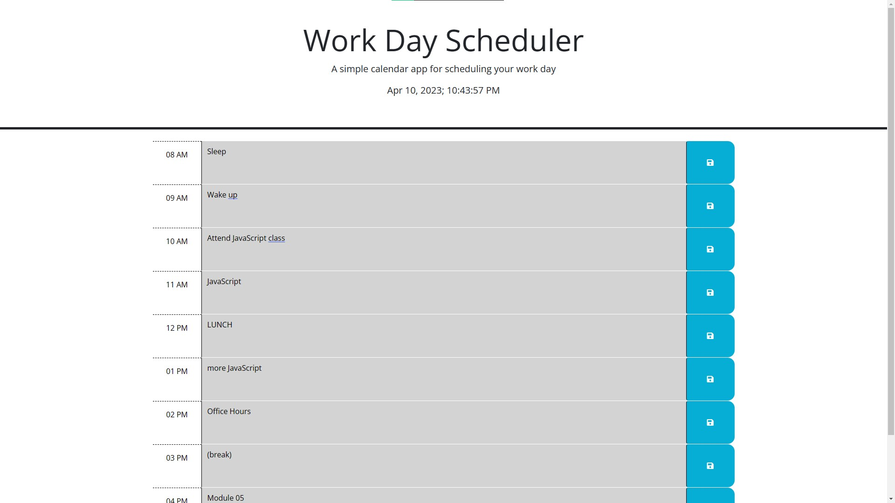

# Work Day Scheduler

## Description

This time table sets a daily schedule throughout a work day (08 AM to 05 PM). Users can input text as tasks within a time slot, save those tasks for later, and check whether the task is in the past, present, or future.

The JavaScript uses DOM traversal, objects, attributes, appends, event listeners, local storage, and third-party APIs such as jQuery and Day.js to create and store time tables.

## Installation

N/A

## Usage

Open the website (<>), type in any desired text inside of a schedule row, and click on the 'Save' button on the row's right to store a text for later use. The text can be overwritten by editing and/or deleting existing text, then pressing the adjacent 'Save' button.

The background color of the time slots change based on whether they're in the past, present or future. Furthermore, a live date and clock are on the top of the page to cross-reference the schedule.

## Credits

Special thanks to the University of Minnesota - Twin Cities for jumpstarting my coding journey.

## License

MIT License

Copyright (c) [2023] [Andrew Joo]

Permission is hereby granted, free of charge, to any person obtaining a copy
of this software and associated documentation files (the "Software"), to deal
in the Software without restriction, including without limitation the rights
to use, copy, modify, merge, publish, distribute, sublicense, and/or sell
copies of the Software, and to permit persons to whom the Software is
furnished to do so, subject to the following conditions:

The above copyright notice and this permission notice shall be included in all
copies or substantial portions of the Software.

THE SOFTWARE IS PROVIDED "AS IS", WITHOUT WARRANTY OF ANY KIND, EXPRESS OR
IMPLIED, INCLUDING BUT NOT LIMITED TO THE WARRANTIES OF MERCHANTABILITY,
FITNESS FOR A PARTICULAR PURPOSE AND NONINFRINGEMENT. IN NO EVENT SHALL THE
AUTHORS OR COPYRIGHT HOLDERS BE LIABLE FOR ANY CLAIM, DAMAGES OR OTHER
LIABILITY, WHETHER IN AN ACTION OF CONTRACT, TORT OR OTHERWISE, ARISING FROM,
OUT OF OR IN CONNECTION WITH THE SOFTWARE OR THE USE OR OTHER DEALINGS IN THE
SOFTWARE.
